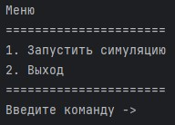
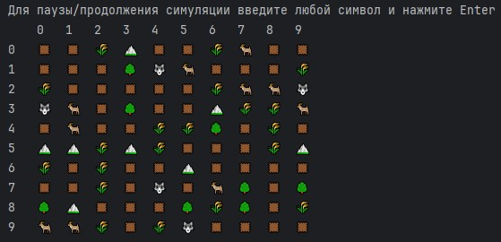

# Симуляция

Суть проекта - пошаговая симуляция 2D мира, населённого травоядными и хищниками.  
Кроме существ, мир содержит ресурсы, которыми питаются травоядные и статичные объекты, которые занимают клетку.

2D мир представляет из себя матрицу NxM, каждое существо или объект занимают клетку целиком, нахождение в клетке нескольких объектов/существ - недопустимо.

Проект создан в рамках **Python Roadmap Сергея Жукова** -> [ссылка](https://zhukovsd.github.io/python-backend-learning-course/)

  

## Основные механики
* Хищники ищут травоядных, для того, чтобы их атаковать. Хищники имеют силу атаки(рассчитанная с зависимостью от их возраста и веса) и диапазон атаки, при атаке у травоядного отнимается запас здоровья, равный силе атаки хищника;
* Травоядные ищут ресурсы. И имеют запас здоровья(рассчитанный с зависимостью от их возраста и веса). При сближении с ресурсами, травоядные встают на место ресурса;
* Существа имеют скорость(количество клеток, которое они могу пройти за 1 ход);
* Существа генерирутся в зависимости от пропорций и размера карты.

## Структура проекта

* [main.py](main.py) Файл, позволяющий запустить процесс симуляции
* [src/launcher.py](src/launcher.py) Содержит класс, позволяющий организовать общение с пользователем
* [src/simulation.py](src/simulation.py) Главный класс приложения, хранит в себе информацию о карте, рендерере карты и списке действий, проводимыми над картой
* [src/actions](src/actions) Директория, содержащая действия над миром
* [src/view.py](src/view.py) Содержит в себе консольное представление игры
* [src/map](src/map) Директория, которая содержит карту и её рендерер
* [src/entities](src/entities) Директория, содержащая классы для всех существ и объектов существующих в симуляции
* [src/entities/creatures](src/entities/creatures) Директория, содержащая классы живых существ
* [src/entities/creatures/way_finder.py](src/entities/creatures/way_finder.py)  Класс, позволяющий найти путь к требуемым сущностям. Поиск пути реализован с использованием "[Поиска в ширину](https://ru.wikipedia.org/wiki/Поиск_в_ширину)"
* [src/entities/resources](src/entities/resources) Директория, содержащая классы ресурсов
* [src/entities/static_objects](src/entities/static_objects) Директория, содержащая классы статичных объектов

## Процесс

1. Начните игру выполнив `python3 main.py` в терминале.
2. На экране появится главное меню игры, введите команду `1` для начала игры.

   

3. После чего запустится симуляция.  

   

4. Симуляцию можно поставить на паузу/продолжить с помощью ввода любого символа с клавиатуры и нажатия Enter.
5. Наблюдайте за симуляцией и наслаждайтесь :)

## Возможное развитие проекта
* Механика размножения существ;
* Механика голода, когда от отсутствия пищи у существ начинает уменьшаться HP;
* Добавление всеядных существ;
* Реализация поиска еды с использованием алгоритма A*;
* Добавление графического интерфейса.

## Стек

* Python 3.11